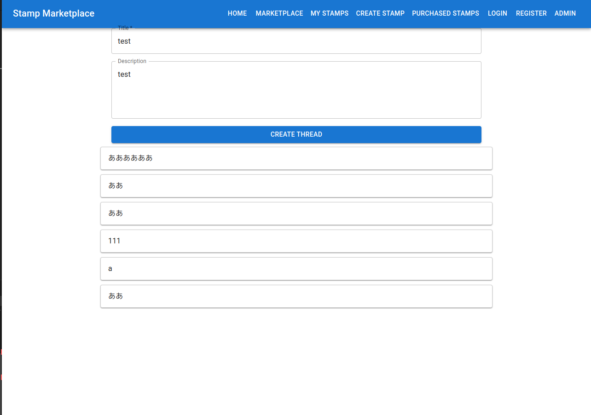
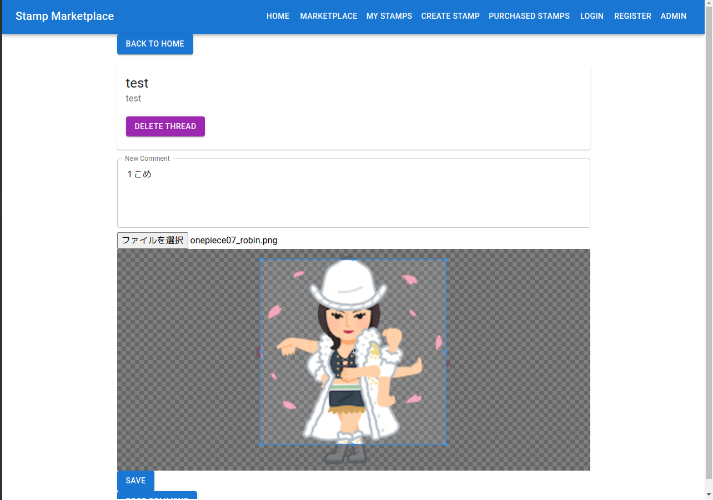
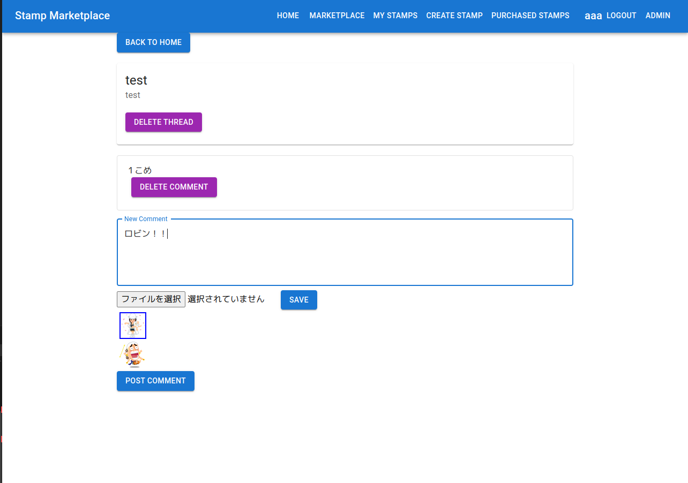
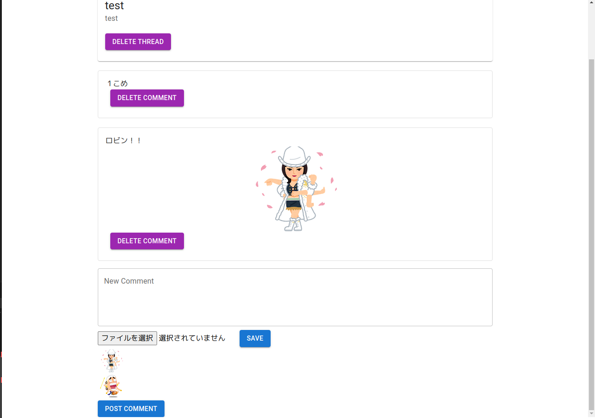
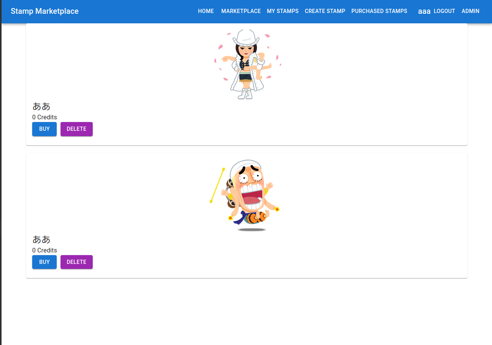

<!-- HTMLを使用して画像を並べる -->


### 実際にこのコードを動かしたときのデモ画像
<div style="display: flex; flex-wrap: wrap;">
  
  
  
  
  
</div>


### 1. パッケージインストール


```bash
# Node.jsのインストール
sudo apt update
sudo apt install nodejs npm

# MongoDBのインストール
sudo apt install -y mongodb

# Pythonのインストール（FlaskがPythonに依存しているため）
sudo apt install python3 python3-pip

# Flaskとその他の依存関係のインストール
pip3 install Flask pymongo
```

### 2. MongoDBのセットアップ
 MongoDBの起動


```bash
sudo systemctl start mongodb
```
MongoDBを自動起動に設定

```bash
sudo systemctl enable mongodb
```

### 3. Flask起動


```bash
export FLASK_APP=app.py
export FLASK_ENV=development
flask run
```

### 4. Next.js起動
依存関係のインストール

```bash
npm install
```
起動
```bash
npm run dev
```


# BBS
db.users.remove({ username: "jun" })
db.users.find({ username: "jun" })
